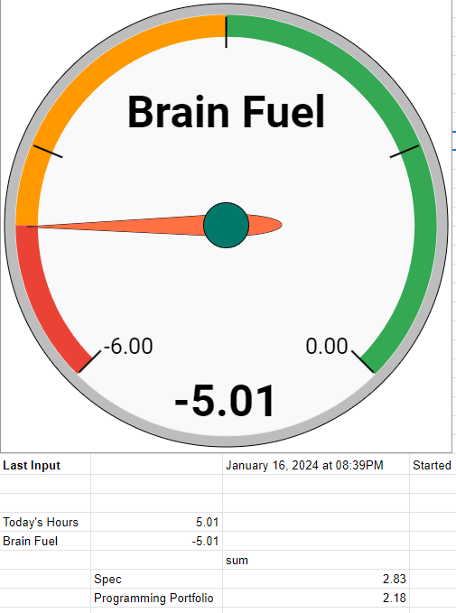

# Executive Summary

This project analyzes time tracked personal working productivity from November 2016 onwards to inform my work trends, habits, and discipline.   

## [Interactive Tableau Dashboard](https://public.tableau.com/app/profile/matthew.tryba/viz/PortfolioProject-TimeTrackingAnalysis/Dashboard1) 

# The Story
As an ambitious freelance music producer, songwriter, and audio engineer navigating the complex wilderness of the music industry I found myself on untrodden paths, reaching into the unknown, and in desperate need of structure. The journey to monetizing music requires multi-decade stamina to hone your craft. A system of discipline is my gateway to freedom, especially on days were motivation waned thin. 

I have autonomy over my time in music production and I want to optimize it. The goal is to achieve a balance of meaningful and sustainable daily productivity that forwards the path to business success while avoiding burnout. It's important to note that tracking productivity is different than tracking "hours at work." The only hours I track in my system are those of meaningful productivity that advance projects to completion. I work on the [Pomodoro Technique](https://en.wikipedia.org/wiki/Pomodoro_Technique) with countdown timers set to 30 minute blocks with a daily goal of 4.5 hours of creative and 1.5 hours of non-creative productivity.

# Data Collection

The data are collected utilizing triggers from IFTTT.com that log clock-in/out stamps with metadata to Google Sheets. 

# Project Goals

- How long is a typical timed work session?
- Are certain days of the weeks more productive?
  - Are there certain activities that occur on certain days?
  - Are there certain times of the day I'm more productive?
  - What time do I start on the most productive days?
- How does total productivity change by month?
- How has my discipline changed over time?
- How many hours have I spent in total on different activities?
- Do I achieve more productive hours in a day with many or few starts/stops?
- On a day with many productive hours, how likely is the next day to be at least x hours less?

# How The Data Has Matured
## Lessons

I've learned that dashboards can be both a tool self harming weapon. At one point I had a "Mega Dashboard of Infinite Understanding of the Entire Business" pinned as the first tab in my web browser. Every day I would see the global view of my business with the theory that being constantly informed was the way to ultimate domineering business success. Over time I realized that I needed to focus on less and less, eventually honing in only on today. My latest daily dashboard below contains only a dial of my energy level and a simple query to sum total hours by activity. 

# Notes On Privacy
The .csv files have been pre-processed for privacy. Client and project names have been replaced with unique IDs.  

# Column Descriptions

`activity`: activity tracked  
`hours`: total time tracked for activity  
`datetime`: date and time activity was finished  
`day_of_week`: weekday of tracked activity  
`year`: year activity occurred  
`week`: week number in year  
`notes`: project notes
`client_id`: unique ID for each client  
`project_id`: unique ID for each project
